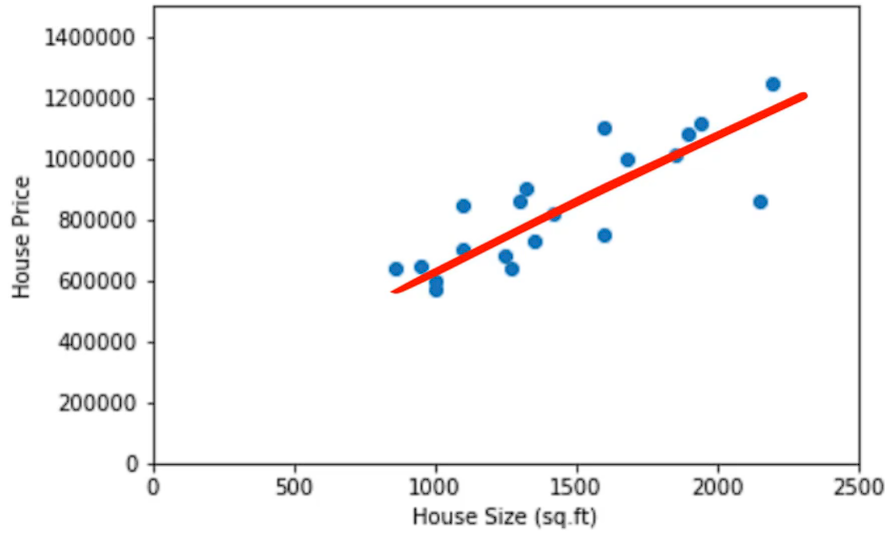
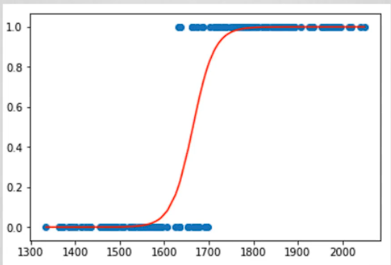
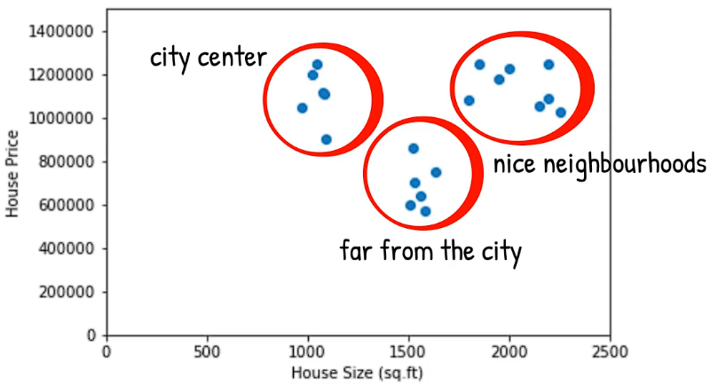

# Overview

When to use Machine Learning:

- Uncover trends and patterns
- Predict outcome
- Dataset is too large to be processed by human
- Have rules and steps that can't be coded

## Data Pre-processing

Invalid Data Handling: Correcting or removing unrealistic values (e.g., age = 400).

Class-labeling:

- Numerical: can be manipulated for calculations.
- Categorical: can't be manipulated, fixed labels, like ID (ID is no useful information)
- Big data: number, text, images, video, audio

Data cleansing: Correcting errors (e.g., typos).

Dealing with mising values: replace them or get rid of them.

Case specific:

- Balancing: a survey was done but there're 80% male -> take an equal number respondents from each group so the ratio is 50-50.
- Data shuffling (randomize data): prevent unwanted patterns, improves predictive perform, helps avoid misleading results -> prevent bias and improve model performance.

## Data Science Traditional Methods

**Predictive analysis**: Access potential future scenarios by using advanced statistical methods.

### Linear Regression

A model used for quantifying causal relationships among the different variables included in your analysis.

```
y = bx
y: house price
b: coefficient
x: house size
```



### Logistic regression

Only contains 0 and 1.


### Clustering analysis



### Factor Analysis

There're many variables that affects the house price, not just the house size.

```math
y = a + b_1x_1 + ... + b_nx_n
```

```
x: explanatory variable / regressor / predictor variable / independent variable
```

A survey consists of 100 questions -> 100 variables.
Sometimes different questions are measuring the same issue -> use factor analysis.

On a scale from 1 to 5

1. I like animals.
2. I care about animals.
3. I'm against animal cruelty.

People are likely to respond consistently. Who marks 5 for the first question, does the same for the rest. With factor analysis, conbine 3 variables into 1.

Now you can reduce the dimentionality of the problem from 100 to 10. It reduces accuracy but avoid noises and the risk of overfitting.

## Data Science Machine Learning

A model is a mathematical relationship derived from data that an ML system uses to make predictions.

- Supervised learning: all binary classification uses this.
- Unsupervised learning
- Reinforcement learning: uses rewards as a way to give the system incentive to find new patterns.

Supervised -> classify
Unsupervised -> cluster

- Predictive AI: small, sleek, specific, cost less processing power.
- Generative AI: don't make predictions, complex, require massive data, cost more processing power.

## Supervised learning

We know what we're aiming for, data is labelled, with time and resources.
Known input, output.
Example: regression, classification

## Unsupervised learning

It groups data based on input data, doesn't rely on defined dataset, operatess in dynamic environment, learns through experience.
Example: clustering

***Give a robot a bag of unlabeled arrows and tell it to shoot without targets. This way, you're not looking for a model that helps you shoot better, but you're looking for a model that divides the arrows in a certain way.***

***Scenario:*** The robot shoots arrows into an area with trees, houses, and the ground. After many shots, arrows are found in different places.

- Broken arrows are identified by being on the ground nearby.
- Arrows can be grouped into sizes: small, medium, and large.
- There might be crossbow bolts mixed in, which wouldn't work with a simple bow.

After extensive training, the robot may uncover surprising insights:

- It could categorize arrows into five sizes instpead of four because of the crossbow bolts.
- It might also predict which arrows are about to break by placing them in the broken pile.

Supervised learning can deal with such problems too.

## Reinforcement learning
